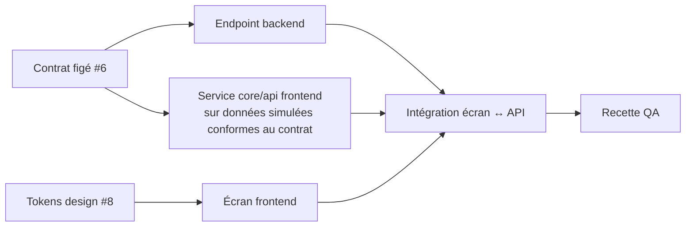

# Plan de coordination et de communication entre équipes

**Équipes :** Analyse/PO · Design · Backend · Frontend · DevOps · QA.
**Principe :** une décision qui n'est pas écrite dans une issue, une PR ou `docs/` n'existe pas.

## 1. Canaux

| Canal | Sert à | Ne sert pas à |
|---|---|---|
| **Issue GitHub** | Besoin, critères, décisions et questions, en commentaire | Discuter du code ligne à ligne |
| **Pull request** | Revue technique, preuves, validation de la DoD | Changer le périmètre (→ issue) |
| **GitHub Projects** (tableau) | Voir qui fait quoi et l'état de chaque ticket | — |
| **`docs/`** | Référence stable : cahier, spécifications, contrat, design | Notes temporaires |
| **Point de synchronisation** (5 min) | Débloquer, réordonner | Prendre une décision non retranscrite |

## 2. Rituels (journée du 25/09)

| Moment | Rituel | Participants | Sortie écrite |
|---|---|---|---|
| 13h05 | Kickoff : lecture du cadre (#1) et du planning | Tous | — |
| Fin de chaque sprint | Synchro : fait / bloqué / suivant | Tous | Commentaire sur l'issue du sprint suivant si réordonnancement |
| Avant chaque `[JALON]` | Revue de jalon : DoD, recette, tests verts | Tous, QA mène | Entrée du `JOURNAL.md` |
| Ouverture de l'enveloppe | Analyse d'impact | Analyse + leads | Issues `[Evolution]` et `[Backend-Bug]` |
| Fin de journée | Rétrospective en une ligne | Tous | `JOURNAL.md`, étape 6 |

## 3. Interfaces entre équipes (contrats de travail)

| De → vers | Artefact d'échange | Règle |
|---|---|---|
| Analyse → toutes | Cahier des charges, spécifications, backlog | Le cahier fait foi ; toute divergence se discute en commentaire du ticket |
| Backend ↔ Frontend | [`api/contrat.yaml`](../api/contrat.yaml) | Modifié **avant** le code, dans une PR relue par les deux équipes ; `info.version` incrémentée |
| Design → Frontend | [Tokens et templates](design/) | Handoff = tokens copiés dans `frontend/src/styles.css` et `tailwind.config.js`, sans réinterprétation |
| Backend → DevOps | Variables dans `.env.example`, migrations | Toute nouvelle variable est ajoutée à `.env.example` et au README dans la même PR |
| DevOps → toutes | CI, `docker-compose.yml` | Une CI rouge sur `main` bloque toutes les équipes : priorité absolue |
| QA → toutes | Plan de test, rapports de recette, bugs | Un bug = une issue `[Backend-Bug]`/`[Frontend-Bug]` avec reproduction |

## 4. Dépendances et ordonnancement

Le frontend n'attend pas le backend : il code contre le contrat, avec des données simulées, puis se branche sur l'API réelle dès que le ticket backend correspondant est fusionné.

## 5. Matrice RACI

R = réalise · A = approuve · C = consulté · I = informé

| Livrable | Analyse/PO | Design | Backend | Frontend | DevOps | QA |
|---|---|---|---|---|---|---|
| Cahier des charges, spécifications | R/A | C | C | C | I | C |
| Contrat d'API | A | I | R | C | I | C |
| Migrations Flyway, diagramme D2 | C | — | R/A | I | C | I |
| Système de design, templates | A | R | — | C | — | I |
| Écrans | A | C | I | R | — | C |
| CI, Docker, `.env.example` | I | — | C | C | R/A | C |
| Recette, rapport de tests | A | — | C | C | I | R |
| Jalons, tags, CHANGELOG | A | I | C | C | R | C |

## 6. Definition of Ready (avant de commencer un ticket)

- Critères d'acceptation vérifiables, RG citées.
- Contrat prêt pour les opérations concernées.
- Dépendances fusionnées, ou données simulées disponibles.
- Templates visuels disponibles pour un ticket d'écran.

La **Definition of Done** commune est dans [CONTRIBUTING.md §4](CONTRIBUTING.md#4-definition-of-done).

## 7. Escalade

1. Ambiguïté ou contradiction → **commentaire sur le ticket**, en citant le cahier (§, RGx, Qx).
2. Pas de réponse avant la fin du sprint → arbitrage du PO, écrit dans le ticket.
3. La décision modifie une règle → PR `docs/` sur le cahier (§7 et journal des révisions) **avant** le code.
4. Blocage technique de plus de 15 min → signalé à la synchro, ticket suivant pris, blocage noté dans le journal.
