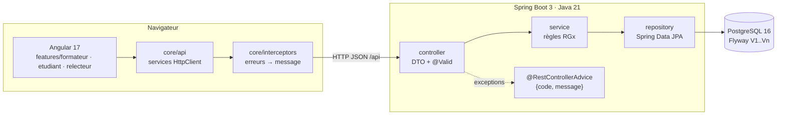
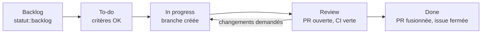
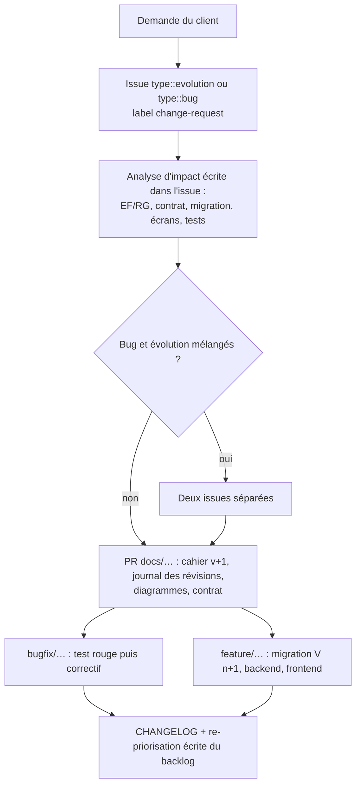

# Plan technique et méthodes de travail en équipe — PRESENCE48

**Public :** toute personne qui reprend, maintient ou fait évoluer ce projet (développeurs backend et frontend, DevOps, testeurs).
**Règles pratiques au quotidien (branches, commits, PR) :** [CONTRIBUTING.md](CONTRIBUTING.md). Ce document explique **quoi, avec quoi et pourquoi**.

---

## 1. Principes directeurs

1. **Le cahier des charges fait foi.** Toute divergence entre le code, un ticket et [CAHIER_DES_CHARGES.md](CAHIER_DES_CHARGES.md) se résout en corrigeant l'un ou l'autre dans une PR, jamais en silence.
2. **Contract-first.** [api/contrat.yaml](../api/contrat.yaml) est la frontière entre le backend et le frontend. On le modifie **avant** le code qui l'implémente.
3. **Traçabilité de bout en bout :** `EFx/RGx` → issue `#n` → branche `…/gh-n-…` → commits `Refs: #n` → PR `Closes #n` → test dont le nom cite la RG → entrée du CHANGELOG.
4. **Rien d'implicite.** Une hypothèse ou un changement d'exigence est écrit (cahier §7, journal des révisions) et commité.
5. **`main` est toujours livrable :** CI verte, pas de commit direct, pas de `push --force`.

## 2. Cycle SDLC appliqué au projet

| Phase | Activités | Outils | Livrables | Qui | Jalon |
|---|---|---|---|---|---|
| **1. Planification** | Lire sujet et client, créer le dépôt public, fixer périmètre, MoSCoW et démarche | GitHub, Git | Cahier §3 et §10, `.gitignore` | Architecte / PO | — (1er commit = `.gitignore`) |
| **2. Analyse des besoins** | Brainstorming sur Q1–Q16, repérer contradictions et trous, EF/RG numérotées, user stories | Markdown, IA (vérifiée contre `CLIENT.md`) | Cahier des charges, spécifications, backlog en issues | BA / PO | — |
| **3. Conception** | D1–D4, modèle de données ↔ migration V1, contrat figé, architecture en couches, architecture Angular | Mermaid, Swagger Editor / Redocly | `docs/diagrammes/`, `api/contrat.yaml` | Architecte, leads | `[JALON] analyse` |
| **4. Implémentation** | Stories Must, une branche par issue, revue de PR | IntelliJ / VS Code, Maven wrapper, Angular CLI | Code dans `backend/`, `frontend/`, migrations | Backend, Frontend | `[JALON] v0.1` |
| **5. Tests & QA** | Tests unitaires RG, intégration endpoints, recette R1–R9 | JUnit 5, Mockito, MockMvc, Jasmine, Bruno | Rapport de recette dans la PR de release | QA | — |
| **6. Déploiement** | Docker Compose, README testé depuis un clone vierge, tag, CHANGELOG | Docker, GitHub Actions | `docker-compose.yml`, release notes | DevOps | `[JALON] v1.0` |
| **7. Maintenance & évolution** | Bug + changement de besoin (enveloppe), nouvelles migrations, mise à jour de l'analyse | Git, issues `change-request` | Cahier v2, diagrammes à jour, migration V{n} | Toute l'équipe | — |

## 2 bis. Choix de la stack et justification

Critères de choix, par ordre de poids : **contraintes du sujet** (B1–B6, F1–F3), **maturité et support long terme**, **productivité d'une équipe junior à confirmée**, **testabilité**, **coût nul** (outils libres ou gratuits pour un dépôt public).

| Couche | Choix | Version | Pourquoi | Alternative écartée |
|---|---|---|---|---|
| Langage backend | **Java** | 21 LTS | Imposé ≥ 17 (B1) ; 21 est la LTS disponible sur les postes (`java -version` = 21.0.11) ; records et pattern matching allègent les DTO | Java 17 : possible mais moins expressif |
| Framework backend | **Spring Boot** | 4.1.1 | Imposé ; dernière version stable proposée par Spring Initializr le 25/09 (la 3.3 prévue n'y figure plus) ; starters modulaires (`webmvc`, `flyway`), Hibernate 7 | Spring Boot 3.x : fin de support en cours |
| Build | **Maven + wrapper `mvnw`** | 3.9 | Imposé (B1) ; build identique partout | Gradle : hors contrainte |
| Persistance | **Spring Data JPA / Hibernate** | 7.x | Repositories déclaratifs, requêtes agrégées JPQL pour le tableau | JDBC Template : plus verbeux |
| Sécurité *(v2)* | **Spring Security** | 7 (Boot 4.1) | Session serveur + cookie HttpOnly (vraie déconnexion, pas de jeton en localStorage), BCrypt, CSRF par cookie repris nativement par Angular, `@PreAuthorize` par rôle ; réponses 401/403 branchées sur `{code, message}` | JWT : déconnexion impossible sans liste noire, jeton exposé au XSS s'il est stocké côté navigateur |
| Stockage de fichiers *(v2)* | **Disque local** (`UPLOAD_DIR`, volume Docker) | — | Simple, sans service externe ; fichiers jamais servis en statique, uniquement via l'API contrôlée | S3/MinIO : service de plus à exploiter pour l'épreuve |
| Validation | **Jakarta Bean Validation** | 3 | `@Valid` sur les DTO, erreurs 400 homogènes (B4) | Validation manuelle : dupliquée |
| Migrations | **Flyway** | 10 | SQL lisible et diffable, versions ordonnées (B5), relu en revue | Liquibase : XML/YAML plus lourd à relire |
| Base de données | **PostgreSQL** | 16 | Contraintes UNIQUE et CHECK fiables, `timestamptz` pour les expirations (RG1) | MySQL : fuseaux horaires moins stricts |
| Base de test | **H2 (mode PostgreSQL)** puis **Testcontainers** si le temps le permet | 2.x / 1.20 | Les tests tournent sur un poste vierge sans base locale (B6) | Base locale : interdite par B6 |
| Documentation d'API | **springdoc-openapi** | 3.1.1 (branche 3.x, compatible Spring Boot 4) | Swagger UI sur `/swagger-ui.html` : contrat de référence et doc générée côte à côte (#96) | 2.x : incompatible avec Spring Boot 4 |
| Mapping | **MapStruct** | 1.6 | Mapping entité ↔ DTO généré à la compilation, pas de réflexion | ModelMapper : erreurs à l'exécution |
| Tests backend | **JUnit 5, Mockito, AssertJ, JaCoCo** | — | Standard Spring ; JaCoCo alimente Sonar | — |
| Langage frontend | **TypeScript** (mode `strict`) | 5.4 | Les modèles typés du contrat détectent les écarts à la compilation | JavaScript : erreurs à l'exécution |
| Framework frontend | **Angular** | 17 (standalone) | Injection de dépendances et `HttpClient` isolent la couche API (F3) ; structure imposée d'équipe (`core/features/shared`) ; squelette déjà prêt | React/Next.js : liberté d'architecture, donc plus de conventions à écrire |
| Réactivité | **RxJS** | 7.8 | Natif Angular ; gestion propre du chargement et des erreurs | — |
| Design system | **Tailwind CSS + spartan/ui** (shadcn pour Angular) + lucide-angular | 3.4 / alpha | Voir [design/DESIGN_SYSTEM.md](design/DESIGN_SYSTEM.md) | Angular Material : visuel éloigné de shadcn |
| Qualité frontend | **ESLint (angular-eslint) + Prettier** | — | Style uniforme, analyse statique | TSLint : abandonné |
| Tests frontend | **Jasmine + Karma** (ChromeHeadless) | — | Fournis par Angular CLI 17, rien à configurer | Jest : migration non justifiée ici |
| Conteneurs | **Docker + Docker Compose** | 24+ | `docker compose up` répond à ENF5 | Installation manuelle : 3 commandes max à tenir |
| Serveur frontend | **nginx** | 1.27 | Sert le build Angular et relaie `/api` (pas de CORS en production) | `ng serve` : serveur de développement seulement |
| CI | **GitHub Actions** | — | Intégré au dépôt, gratuit en public, statut visible sur chaque PR | Jenkins : infrastructure à maintenir |
| Qualité continue | **SonarQube Server** de l'équipe + extension **SonarQube for IDE** (mode connecté) | 2026.4 / 5.10 | Serveur déjà en place (`http://10.0.102.40:9000`) avec la Quality Gate de l'équipe ; l'extension applique les mêmes règles **pendant la frappe**, avant même le commit | SonarCloud : doublonnerait le serveur interne et ses règles |
| Dépendances | **Dependabot** | — | PR automatiques de mise à jour, branches `chore/` | Renovate : équivalent, plus complexe |
| Tests d'API | **Bruno** | — | Collections en fichiers texte versionnés (diffables), CLI `bru run` en CI | Postman : collections JSON liées à un compte |

## 2 ter. Qualité du code : Sonar, tests unitaires et tests de régression

**Sonar : SonarQube Server + SonarQube for IDE (mode connecté)**

- **Serveur :** `http://10.0.102.40:9000` (SonarQube Server 2026.4), projet `kfokam48-epreuve-230`, créé le 25/09.
- **Dans l'éditeur :** l'extension VS Code *SonarQube for IDE* est liée au projet par `.vscode/settings.json` (versionné, sans secret) : `connectionId` `http-10-0-102-40-9000-`, `projectKey` `kfokam48-epreuve-230`. Chaque développeur voit les règles du serveur en direct. La connexion elle-même, avec son jeton, est configurée une fois par poste dans VS Code (*SonarQube Setup › Add SonarQube Server Connection*) et reste dans le trousseau de VS Code.
- **Analyse complète, avant chaque PR** (obligatoire, le serveur étant sur le réseau privé, la CI GitHub ne peut pas l'atteindre) :
  - backend : `set -a; . ./.env; set +a; ./mvnw -f backend verify sonar:sonar -Dsonar.host.url=$SONAR_HOST_URL -Dsonar.token=$SONAR_TOKEN -Dsonar.projectKey=$SONAR_PROJECT_KEY` (couverture JaCoCo) ;
  - frontend (#103) : `cd frontend && npx ng test --watch=false --browsers=ChromeHeadless --code-coverage && npx @sonar/scan -Dsonar.host.url=$SONAR_HOST_URL -Dsonar.token=$SONAR_TOKEN` avec `frontend/sonar-project.properties` (couverture `coverage/lcov.info`, rapport lcov ajouté par `frontend/karma.conf.js`).
  **Deux projets Sonar** : `kfokam48-epreuve-230` (backend) et `kfokam48-epreuve-230-frontend` (TypeScript et templates HTML). Un seul projet ne convient pas : chaque analyse remplace la précédente, la seconde effacerait la première. La même Quality Gate s'applique aux deux ; le lien du tableau de bord et le statut vont dans la section Preuves de la PR.
- **Quality Gate appliquée : « TEFO CBS »** (Quality Gate par défaut du serveur, lue par l'API le 25/09) — bloquante pour la fusion :

  | Condition sur le nouveau code | Seuil |
  |---|---|
  | Nouvelles violations (bugs, vulnérabilités, code smells) | 0 |
  | Couverture | ≥ 80 % |
  | Lignes dupliquées | ≤ 3 % |
  | Hotspots de sécurité revus | 100 % |

- **Risque signalé :** 80 % de couverture sur tout nouveau code est exigeant avec le temps disponible. Si la Quality Gate échoue sur la couverture, la PR le dit explicitement ; on ne fusionne pas en silence.
- **Secrets :** `SONAR_TOKEN` n'existe que dans `.env` (local) ; `.env.example` documente `SONAR_HOST_URL`, `SONAR_TOKEN`, `SONAR_PROJECT_KEY`.

**Tests unitaires**

| Équipe | Cible | Règle |
|---|---|---|
| Backend | Services métier (Mockito, horloge `Clock` fixe) | un test par RG, nommé `testRgX…` (profil qualité : `^test[A-Z][a-zA-Z0-9]*$`) ; cas nominal + chaque erreur |
| Frontend | Services `core/api` (`HttpTestingController`) et composants de page | vérifier URL, verbe, corps, et l'affichage des états chargement / erreur / vide |

**Tests d'intégration** : backend `@SpringBootTest` + MockMvc, un test par endpoint et par code HTTP du contrat.

**Tests de régression**

- La suite complète (unitaires + intégration, backend et frontend) tourne en CI sur **chaque PR** et bloque la fusion si elle échoue.
- Chaque bug corrigé laisse un test de régression nommé `testReg<n°issue><Comportement>` (ex. `testReg45NoteNullNeCassePasLaMoyenne`), commité **rouge** avant le correctif.
- Collection Bruno `api/bruno/` rejouée en CI (`bru run --env local`) : un appel par code d'erreur du catalogue, qui vérifie le format `{code, message}`.
- Recette R1–R9 ([spécifications §7](SPECIFICATIONS_FONCTIONNELLES.md#7-scénarios-de-recette)) rejouée à la main avant chaque jalon, avec les preuves jointes à la PR du jalon.

## 3. Architecture de référence



**Backend — paquet `com.k48.leonel.presence48` :**

```text
controller/     un contrôleur par ressource, aucun accès base
service/        interfaces + impl/ ; les règles RGx vivent ici
repository/     Spring Data JPA, requêtes agrégées pour le tableau
entity/         entités JPA, jamais sérialisées
dto/request/    records d'entrée + jakarta.validation
dto/response/   records de sortie conformes au contrat
mapper/         entité ↔ DTO (MapStruct ou mappers manuels)
exception/      MetierException(code, HttpStatus) + sous-classes + GlobalExceptionHandler
config/         horloge injectable (Clock) pour tester RG1 et RG4
resources/db/migration/   V1__init.sql, V2__donnees_demo.sql, …
```

**Frontend — `frontend/src/app` :**

```text
core/api/           session-api.service.ts, presence-api.service.ts, … (seul endroit qui appelle HttpClient)
core/models/        interfaces TS alignées sur le contrat (erreur.model.ts = {code, message})
core/interceptors/  error.interceptor.ts : normalise les erreurs HTTP
core/services/      identite.service.ts (identité choisie, localStorage)
features/formateur/ pages sessions, session-detail, tableau
features/etudiant/  pages identification, presence, exercices
features/relecteur/ page relectures
shared/components/  chargement, message-erreur, etat-vide
```

## 4. Workflow de gestion (GitHub)



- **Outil : GitHub Issues + GitHub Projects (tableau Kanban) + Milestones `v0.1` / `v1.0`.** Pourquoi : les issues et PR sont notées par l'épreuve, et elles sont liées nativement aux commits (`Closes #n`). Jira et Confluence ne sont pas utilisés : ce serait un second référentiel à synchroniser.
- **Labels à portée** (même principe que le projet SEKOUH) :
  - `priority :: critical | high | medium | low` (Must = high, Should = medium, Could = low) ;
  - `statut :: backlog | to-do | in progress | review | done` ;
  - `team :: back-end | front-end | devops | qa | analyse` ;
  - `type :: feature | bug | evolution | documentation | chore | refactor`.
- **Ticket cadre épinglé** : « [KICKOFF] Cadre de travail commun — branches, commits, PR et preuves ». Chaque ticket y renvoie.
- **Ordre de travail :** par priorité, un ticket à la fois par personne. Un ticket ambigu ou contraire au cahier fait l'objet d'un **commentaire sur le ticket** : on ne tranche pas seul.

## 5. Gestion des versions

**SemVer `MAJOR.MINOR.PATCH`**, avec des candidats `-rc.N` et un numéro de build CI.

| Segment | Sens | Exemple |
|---|---|---|
| MAJOR | Rupture de contrat d'API ou jalon produit majeur | `1.0.0` |
| MINOR | Livraison planifiée avec de nouvelles fonctionnalités | `0.1.0`, `0.2.0` |
| PATCH | Correctif livré sur une version existante | `0.1.1` |
| `-rc.N` | Candidat en stabilisation | `0.1.0-rc.1` |
| `+build.N` | Numéro de pipeline CI, sur l'image Docker | `0.1.0+build.42` |

| Moment | Tag Git | Image |
|---|---|---|
| Candidat (recette) | `v0.1.0-rc.1` | `presence48-backend:0.1.0-rc.1` |
| Final | `v0.1.0` | `presence48-backend:0.1.0` |

- Les jalons de l'épreuve (`[JALON] v0.1`, `[JALON] v1.0`) sont des **commits vides** ; le tag SemVer est posé sur ce même commit.
- Branche `release-X.Y` créée **seulement** si une stabilisation est nécessaire pendant que `main` avance. Les correctifs y passent par `hotfix-X.Y/…`, puis sont reportés sur `main` par `git cherry-pick -x`.
- Le **contrat d'API** porte sa propre version (`info.version`) : +MINOR pour un ajout compatible, +MAJOR pour une rupture.
- `CHANGELOG.md` au format *Keep a Changelog* : Added / Changed / Fixed / Removed, avec les liens vers les PR.

## 6. Plan par équipe

### 6.1 Backend

| Sujet | Méthode | Outils (pourquoi) |
|---|---|---|
| Construction | `./mvnw verify` doit passer en local avant chaque PR | **Maven wrapper** : même version de Maven chez tous (B1) |
| Couches | controller → service → repository ; DTO en records ; entités jamais exposées | Spring Boot 3, Spring Data JPA (B3) |
| Validation et erreurs | `@Valid` sur les DTO ; exceptions métier portant `code` et statut ; un seul `@RestControllerAdvice`, avec un filet `Exception` → 500 `ERREUR_INTERNE` sans stack trace ; `server.error.whitelabel.enabled=false` | jakarta.validation (B4) |
| Temps | `Clock` injectée, jamais `LocalDateTime.now()` directement | tester l'expiration et le blocage sans attendre |
| Concurrence | contraintes UNIQUE en base comme dernier rempart (double clic, courses) ; `DataIntegrityViolationException` traduite en 409 | PostgreSQL |
| Contrat | chaque PR qui touche une route vérifie le contrat ; Swagger UI pour comparer visuellement | springdoc-openapi |
| **Migrations** | `V{n}__{verbe}_{objet}.sql` ; **jamais** modifier une migration poussée ; une migration par changement de schéma, dans la PR de la fonctionnalité ; D2 mis à jour dans la même PR ; données de démonstration dans une migration séparée (`V2__donnees_demo.sql`) ; `ddl-auto=validate` | **Flyway** : schéma reproductible (B5) |
| Tests | unitaires : services avec Mockito, un test par RG nommé `testRgX…` (profil qualité : `^test[A-Z][a-zA-Z0-9]*$`) ; intégration : `@SpringBootTest` + MockMvc sur H2 en mode PostgreSQL (tourne sur un poste vierge, B6) ; option Testcontainers | JUnit 5, Mockito, AssertJ, JaCoCo |

### 6.2 Frontend

| Sujet | Méthode | Outils (pourquoi) |
|---|---|---|
| Structure | standalone components ; `core/ features/ shared/ layout/` (script `createAngularStructure.sh` corrigé) | Angular 17 : DI et HttpClient isolent la couche API (F3) |
| Appels API | uniquement dans `core/api/*.service.ts` ; les URL viennent de `environment.apiUrl` | HttpClient, RxJS |
| Erreurs et chargement | `error.interceptor` convertit toute erreur en `{code, message}` ; chaque page a les états `chargement / erreur / vide / données` | — |
| Règles métier | **aucune** : pas de calcul de moyenne ni de contrôle d'expiration côté client. Validation de formulaire uniquement ergonomique (champ requis), le serveur fait foi | F3 |
| Évolution du contrat | les modèles TS suivent le contrat ; option : génération avec `openapi-generator-cli` | — |
| Qualité | `ng build` en CI ; ESLint + Prettier | angular-eslint |
| Tests | Jasmine/Karma : services API (HttpTestingController) et un composant par écran | — |
| Mobile | écran Étudiant testé à 360 px (ENF1) | Chrome DevTools |

### 6.3 DevOps

| Sujet | Méthode | Outils (pourquoi) |
|---|---|---|
| Hygiène du dépôt | `.gitignore` Java + Node + IDE posé **avant** le premier code ; jamais `target/`, `node_modules/`, `dist/`, `.env` | Git |
| Secrets | **Toutes les informations sensibles vivent dans `.env`** à la racine (jetons GitHub/Sonar, mots de passe de base), jamais dans le code, `application.yml`, `docker-compose.yml` ni un commit. `.env.example` versionné documente chaque clé. Spring lit `${DB_PASSWORD}` (préfixe volontairement différent de `SPRING_`, voir #51), Compose utilise `env_file: .env`, la CI utilise les secrets GitHub. En cas de fuite : **révoquer d'abord**, nettoyer ensuite | `.env`, secrets GitHub Actions |
| Démarrage | `docker compose up` à la racine : `db` (postgres:16), `backend` (Dockerfile multi-stage Maven → JRE 21), `frontend` (build Node → nginx) ; alternative en 3 commandes dans le README | Docker Compose (ENF5) |
| CI | GitHub Actions sur chaque PR : `./mvnw -B verify`, `npm ci && npm run build && npm test -- --watch=false --browsers=ChromeHeadless`, lint du contrat | GitHub Actions |
| Protection | `main` protégée : PR obligatoire, CI verte requise, pas de force-push | règles de branche GitHub |
| Dépendances | mises à jour groupées dans des branches `chore/…` | Dependabot |
| Livraison | tag SemVer → image Docker étiquetée ; retour arrière = redéployer le tag précédent (les migrations étant additives, le schéma reste compatible) | — |

### 6.4 Tests / QA

| Sujet | Méthode | Outils |
|---|---|---|
| Plan de test | dérivé des scénarios Gherkin (spécifications §4) et de la recette R1–R9 (§7) | — |
| Traçabilité | matrice EF ↔ RG ↔ test (spécifications §6) tenue à jour à chaque PR | — |
| Bug | **reproduire d'abord** : un test rouge commité dans la branche `bugfix/…`, puis le correctif qui le passe au vert | JUnit, Bruno |
| Contrat | pour chaque code d'erreur du catalogue : un appel qui le déclenche et vérifie `{code, message}` | collection **Bruno** versionnée dans `api/bruno/` (fichiers texte, diffables) |
| Non-régression | toute la suite tourne en CI ; recette R1–R9 rejouée avant chaque jalon | — |
| Preuves | chaque PR contient ses preuves (réponse curl/Bruno avant et après, capture d'écran pour le front) | — |

## 7. Gestion des changements d'exigences

Déclencheur : retour client, bug, enveloppe de l'étape 3.



Règles :

- l'analyse est mise à jour **avant** ou **avec** le code, jamais après coup ; le commit le dit : `docs(cdc): réviser RG14 suite au changement de besoin` ;
- une ancienne RG n'est pas effacée : elle est marquée « remplacée par RGy (v2) » pour que l'historique reste lisible ;
- une migration existante ne change jamais : on en ajoute une nouvelle, avec les données reprises si nécessaire ;
- un changement incompatible du contrat donne une version MAJOR du contrat, signalée au frontend dans la PR.

## 8. Usage de l'IA

Autorisé. Pour chaque production de l'IA, le journal indique **comment elle a été vérifiée** : relecture contre `CLIENT.md` et le contrat, tests qui passent, exécution réelle. Aucune sortie d'IA n'est commitée sans avoir été lue.
