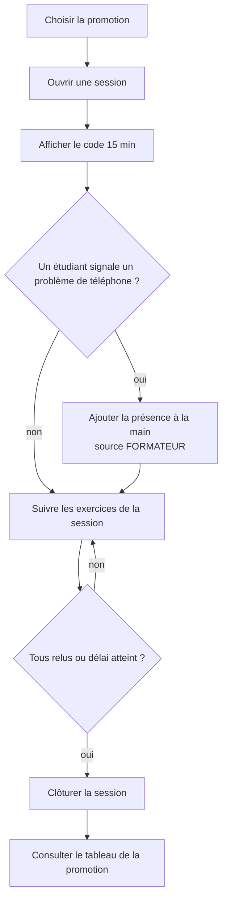
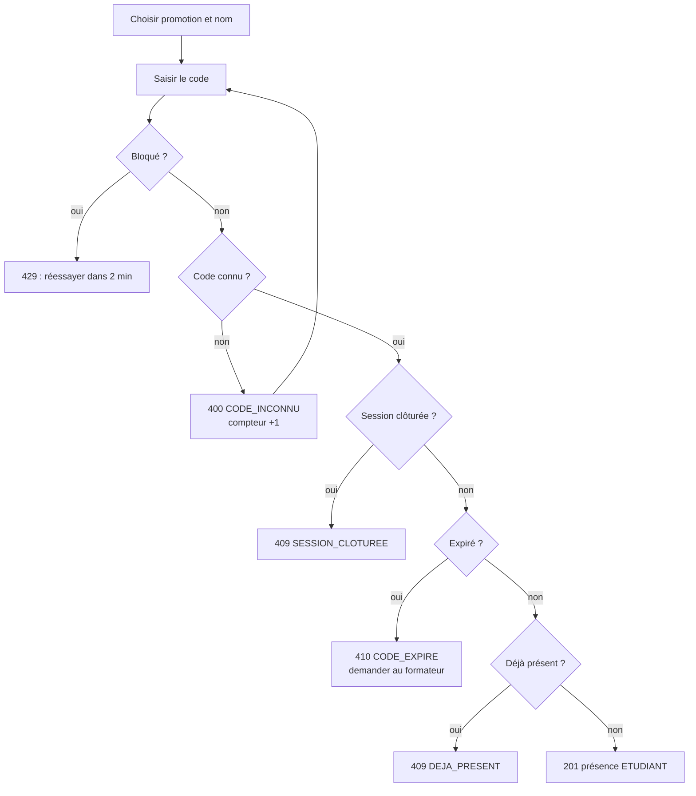
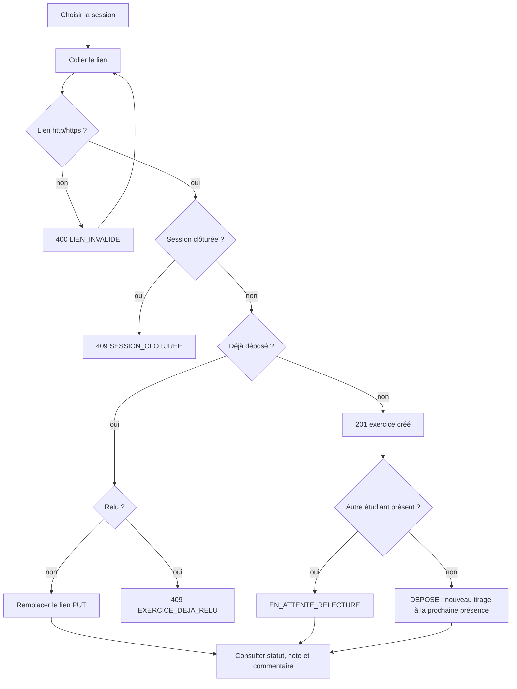
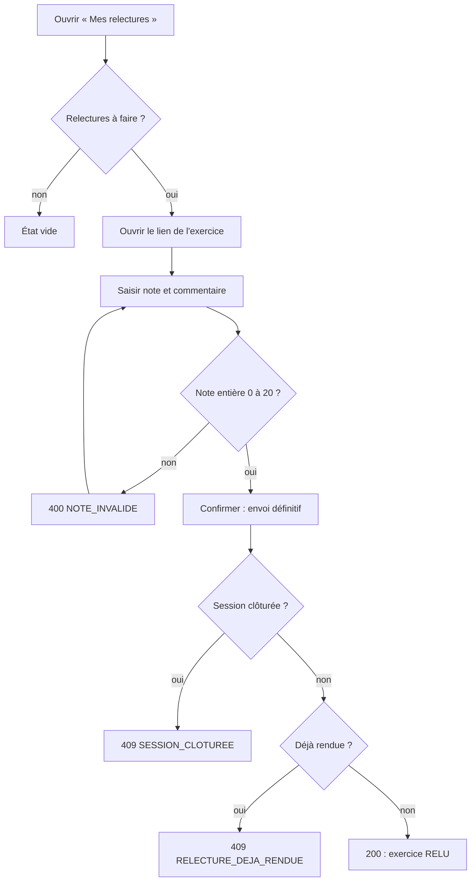
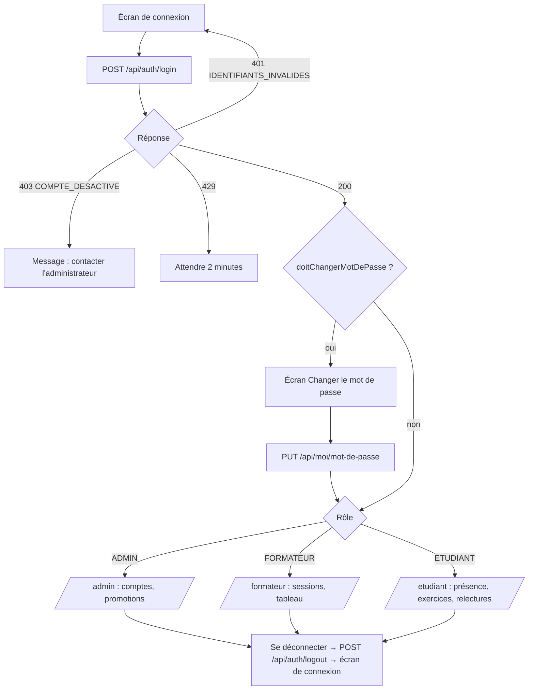

# Spécifications fonctionnelles détaillées — PRESENCE48

**Version :** 2 · **Date :** 2026-09-25 (v2 : sécurité, rôles, CRUD, pièce jointe — #54) · **Auteur :** nono leonel (230)
**Référence :** [CAHIER_DES_CHARGES.md](CAHIER_DES_CHARGES.md). En cas de divergence, **le cahier des charges fait foi** ; ce document le détaille sans rien y ajouter.

## Sommaire

1. [Vue d'ensemble et navigation](#1-vue-densemble-et-navigation)
2. [Fiches de spécification (SF-1 à SF-14)](#2-fiches-de-spécification)
3. [Flows (parcours utilisateur)](#3-flows)
4. [User stories par épopée](#4-user-stories)
5. [Catalogue des codes d'erreur](#5-catalogue-des-codes-derreur)
6. [Matrice de traçabilité](#6-matrice-de-traçabilité)
7. [Scénarios de recette](#7-scénarios-de-recette)

---

## 1. Vue d'ensemble et navigation

### 1.1 Modules

| Module | Fiches | Épopée (issues) | Écran |
|---|---|---|---|
| Identification | SF-1 | E0 Identification | Accueil |
| Sessions | SF-2, SF-11, SF-12 | E1 Sessions | Formateur |
| Présence | SF-3, SF-4, SF-5 | E2 Présence | Étudiant, Formateur |
| Exercices | SF-6, SF-13, SF-14 | E3 Exercices | Étudiant |
| Relecture | SF-7, SF-8, SF-9 | E4 Relecture | Relecteur |
| Pilotage | SF-10 | E5 Pilotage | Formateur |
| Authentification *(v2)* | SF-15 à SF-18 | E6 Accès | Connexion, Profil |
| Droits *(v2)* | SF-19 | E6 Accès | tous |
| Administration *(v2)* | SF-20 à SF-23 | E7 Administration | Administration |
| Pièce jointe *(v2)* | SF-24 | E3 Exercices | Étudiant |

> **v2 :** toutes les routes exigent une session **sauf les 5 opérations imposées** (RG22). Matrice des droits : [cahier §2 bis](CAHIER_DES_CHARGES.md#2-bis-matrice-des-droits-par-rôle-v2). Arborescence v2 : `/connexion` (public) → redirection selon le rôle vers `/admin`, `/formateur` ou `/etudiant` ; `/profil` pour tous ; en-tête avec le nom connecté et « Se déconnecter ».

### 1.2 Arborescence

```text
/                           Accueil : « Je suis formateur » | « Je suis étudiant »
├── /formateur              Choix de la promotion
│   ├── /formateur/:promotionId/sessions        Liste + « Ouvrir une session » (SF-2)
│   │   └── /formateur/sessions/:id             Code affiché en grand + compte à rebours,
│   │                                           exercices et statuts (SF-11), présence manuelle (SF-5),
│   │                                           bouton « Clôturer » (SF-12)
│   └── /formateur/:promotionId/tableau         Tableau (SF-10)
└── /etudiant               Choix promotion puis nom (SF-1) — mémorisé dans le navigateur
    ├── /etudiant/presence      Saisie du code (SF-3)
    ├── /etudiant/exercices     Dépôt / remplacement (SF-6, SF-13), notes reçues (SF-14)
    └── /relecteur              Relectures à faire / rendues (SF-8, SF-9)
```

### 1.3 Zoning des trois écrans imposés (F2)

```text
┌─ ÉCRAN FORMATEUR ─────────────────────────────┐   ┌─ ÉCRAN ÉTUDIANT (mobile 360px) ─┐
│ Promotion [P1 ▼]            [Tableau]         │   │ Bonjour Awa (P1)   [changer]    │
│ ┌ Ouvrir une session ───────────────────────┐ │   │ ┌ Présence ──────────────────┐  │
│ │ Titre [____________]  [Ouvrir]            │ │   │ │ Code [______]  [Valider]   │  │
│ └───────────────────────────────────────────┘ │   │ │ ✓ / message d'erreur       │  │
│ Session « Spring JPA »  CODE: K7MX4Q  12:41   │   │ └────────────────────────────┘  │
│ Exercices :                                   │   │ ┌ Mon exercice ──────────────┐  │
│  Awa   lien  EN_ATTENTE_RELECTURE  (Paul)     │   │ │ Session [▼] Lien [______]  │  │
│  Paul  lien  RELU  14/20                      │   │ │ [Déposer] / [Remplacer]    │  │
│ Ajouter présence [étudiant ▼] [Ajouter]       │   │ │ Statut · Note · Commentaire│  │
│ [Clôturer la session]                         │   │ └────────────────────────────┘  │
└───────────────────────────────────────────────┘   └─────────────────────────────────┘
┌─ ÉCRAN RELECTEUR ─────────────────────────────┐   ┌─ TABLEAU (formateur) ───────────┐
│ Relectures à faire (2)                        │   │ Nom | Prés. | Dép. | Moy. | Rel.│
│  « Spring JPA »  lien ↗                       │   │ Awa |   3   |  2   | 13,5 |  0  │
│   Note [__] /20  Commentaire [__________]     │   │ Paul|   2   |  1   |  —   |  1 ⚠│
│   [Envoyer — définitif]                       │   │ (— = aucune note, ⚠ = retard)   │
│ Relectures rendues                            │   └─────────────────────────────────┘
└───────────────────────────────────────────────┘
```

Chaque écran gère trois états : **chargement** (indicateur), **erreur** (message issu du champ `message` de l'API) et **vide** (« aucune relecture à faire »). Aucun calcul n'est fait côté client (F3, RG16).

---

## 2. Fiches de spécification

Format de chaque fiche : **acteur · priorité · préconditions · flux nominal · erreurs · règles · endpoint · postconditions**.

### SF-1 — Choisir son identité · EF1 · Must

- **Acteur :** Étudiant (ou Formateur, qui choisit seulement la promotion).
- **Préconditions :** des promotions et des étudiants existent (données de démonstration).
- **Flux nominal :** 1) l'écran charge `GET /api/promotions` ; 2) l'étudiant choisit sa promotion ; 3) l'écran charge `GET /api/promotions/{id}/etudiants` ; 4) il choisit son nom ; 5) l'identité est mémorisée dans le navigateur et envoyée ensuite comme `etudiantId` ou `X-Etudiant-Id`.
- **Erreurs :** `404 PROMOTION_INCONNUE`.
- **Règles :** Q1 (pas de mot de passe), RG19.
- **Postconditions :** aucune écriture en base.
- **Limite signalée :** l'identité est déclarative (HYP-2).

### SF-2 — Ouvrir une session · EF2 · Must

- **Acteur :** Formateur.
- **Flux nominal :** 1) saisie du titre, promotion courante ; 2) `POST /api/sessions {titre, promotionId}` ; 3) le système génère un code unique (RG20, HYP-6), fixe `ouvertureAt = maintenant` et `expirationAt = ouvertureAt + 15 min` (RG1), statut `OUVERTE` ; 4) `201 {id, code, ouvertureAt, expirationAt}` ; 5) l'écran affiche le code et un compte à rebours calculé depuis `expirationAt` (valeur de l'API, pas une règle recalculée).
- **Erreurs :** `400 CHAMP_MANQUANT` (titre vide ou promotionId absent), `400 PROMOTION_INCONNUE`.
- **Postconditions :** une session `OUVERTE`.

### SF-3 — Marquer sa présence avec le code · EF3 · Must

- **Acteur :** Étudiant.
- **Préconditions :** identité choisie (SF-1).
- **Flux nominal :** 1) saisie du code (mise en majuscules et suppression des espaces) ; 2) `POST /api/presences {code, etudiantId}` ; 3) le système vérifie, **dans cet ordre** : étudiant existant → non bloqué (RG4) → code connu → session non clôturée (RG18) → code non expiré (RG1) → étudiant de la promotion (RG19) → pas déjà présent (RG3) ; 4) enregistrement `source = ETUDIANT`, remise à zéro du compteur d'échecs ; 5) tentative d'assignation des exercices de la session restés `DEPOSE` (HYP-3) ; 6) `201`.
- **Erreurs (ordre de priorité) :**

  | Cas | HTTP | code |
  |---|---|---|
  | champ absent, étudiant inconnu | 400 | `CHAMP_MANQUANT`, `ETUDIANT_INCONNU` |
  | étudiant bloqué | 429 | `TROP_DE_TENTATIVES` |
  | code inconnu (incrémente le compteur) | 400 | `CODE_INCONNU` |
  | session clôturée | 409 | `SESSION_CLOTUREE` |
  | code expiré | 410 | `CODE_EXPIRE` |
  | autre promotion | 400 | `ETUDIANT_HORS_PROMOTION` |
  | déjà présent | 409 | `DEJA_PRESENT` |

- **Justification de l'ordre :** le blocage passe avant la lecture du code pour qu'un étudiant bloqué ne puisse plus rien tester. L'expiration passe avant le doublon pour qu'un étudiant déjà présent qui ressaisit un vieux code reçoive l'information la plus utile. Cet ordre est celui du diagramme [D3](diagrammes/D3-sequence-presence.md).
- **Règles :** RG1, RG2, RG3, RG4, RG18, RG19.

### SF-4 — Blocage après 5 codes erronés · EF4 · Should

- **Acteur :** Système.
- **Flux :** chaque `CODE_INCONNU` incrémente `echecs_consecutifs`. Au 5ᵉ échec, `bloque_jusqu_a = maintenant + 2 min` et le compteur repasse à 0. Tant que `maintenant < bloque_jusqu_a`, toute tentative répond `429`. Un succès remet le compteur à 0.
- **Règles :** RG4, HYP-5. **Limite signalée :** contournable en changeant de nom, puisqu'il n'y a pas d'authentification.

### SF-5 — Ajouter une présence à la main · EF5 · Should

- **Acteur :** Formateur.
- **Flux nominal :** `POST /api/sessions/{id}/presences {etudiantId}` → `201` avec `source = FORMATEUR`, même après expiration du code (RG2), puis tentative d'assignation (HYP-3).
- **Erreurs :** `404 SESSION_INTROUVABLE`, `400 ETUDIANT_INCONNU | ETUDIANT_HORS_PROMOTION`, `409 DEJA_PRESENT | SESSION_CLOTUREE`.
- **Règles :** RG3, RG15, RG18, RG19.

### SF-6 — Déposer son exercice · EF6 · Must

- **Acteur :** Étudiant.
- **Flux nominal :** 1) choix de la session parmi celles de sa promotion ; 2) `POST /api/exercices {sessionId, etudiantId, lien}` ; 3) contrôles : lien http(s) valide (RG17) → session et étudiant existants → même promotion (RG19) → session non clôturée (RG18) → pas déjà déposé (RG13) ; 4) création avec le statut `DEPOSE` ; 5) tirage du relecteur (SF-7) ; 6) `201 {id, statut}`, où `statut` vaut `EN_ATTENTE_RELECTURE` ou `DEPOSE`.
- **Erreurs :** `400 LIEN_INVALIDE | CHAMP_MANQUANT | SESSION_INTROUVABLE | ETUDIANT_INCONNU | ETUDIANT_HORS_PROMOTION`, `409 EXERCICE_DEJA_DEPOSE | SESSION_CLOTUREE`.
- **Remarque :** la présence de l'auteur n'est pas exigée (HYP-8, Q12).

### SF-7 — Tirer le relecteur au sort · EF7 · Must

- **Acteur :** Système, déclenché par SF-6, SF-3 et SF-5.
- **Algorithme :** candidats = étudiants **présents** à la session de l'exercice, **auteur exclu** (RG5, RG7). S'il y a au moins un candidat : tirage aléatoire uniforme (`SecureRandom`), création de la `relecture` (note NULL), exercice → `EN_ATTENTE_RELECTURE`. Sinon, l'exercice reste `DEPOSE` (RG11) et le tirage sera retenté à la prochaine présence enregistrée dans la session.
- **Invariant :** au plus une relecture par exercice (RG6), garanti par la contrainte `UNIQUE(exercice_id)`.
- **Non retenu :** l'équilibrage de charge entre relecteurs ; Q7 dit « au hasard », rien de plus. C'est une évolution possible, à valider avec le client.

### SF-8 — Consulter ses relectures · EF8 · Must

- **Acteur :** Relecteur.
- **Flux :** `GET /api/etudiants/{id}/relectures?statut=A_FAIRE` → liste avec le lien et le titre de la session, **sans l'auteur** (HYP-10).
- **Erreurs :** `404 ETUDIANT_INCONNU`.

### SF-9 — Rendre une relecture · EF9 · Must

- **Acteur :** Relecteur.
- **Flux nominal :** 1) saisie de la note et du commentaire, avec confirmation « envoi définitif » ; 2) `POST /api/relectures/{id}` avec l'en-tête `X-Etudiant-Id` ; 3) contrôles : en-tête présent → note entière entre 0 et 20 et commentaire présent (RG9) → relecture existante → appelant ≠ auteur (RG5) → appelant = relecteur assigné → session non clôturée (RG18) → pas déjà rendue (RG10) ; 4) enregistrement de la note, du commentaire et de `rendue_at` ; exercice → `RELU` ; 5) `200`.
- **Erreurs :** `400 NOTE_INVALIDE | CHAMP_MANQUANT`, `403 AUTO_RELECTURE | RELECTEUR_NON_ASSIGNE`, `404 RELECTURE_INTROUVABLE`, `409 SESSION_CLOTUREE | RELECTURE_DEJA_RENDUE`.
- **Note :** RG5 est aussi garantie à l'assignation (SF-7). Le contrôle `403 AUTO_RELECTURE` est une défense en profondeur, exigée par le contrat.

### SF-10 — Tableau de la promotion · EF10 · Must

- **Acteur :** Formateur.
- **Flux :** `GET /api/tableau?promotionId=` → une ligne par étudiant de la promotion, y compris ceux sans aucune activité.

  | Champ | Calcul (serveur uniquement) |
  |---|---|
  | `presences` | nombre de présences, toutes sources confondues, sur les sessions de la promotion |
  | `exercicesDeposes` | nombre d'exercices dont il est l'auteur |
  | `moyenne` | moyenne des notes **rendues** sur ses exercices, arrondie à 2 décimales ; `null` s'il n'en a aucune (RG16) |
  | `relecturesEnAttente` | relectures qui lui sont assignées et pas encore rendues |

- **Erreurs :** `404 PROMOTION_INCONNUE`.
- **Performance :** 3 requêtes agrégées (`GROUP BY`), pas de boucle par étudiant (ENF2).

### SF-11 — Exercices d'une session · EF11 · Should

- **Acteur :** Formateur. `GET /api/sessions/{id}/exercices` → auteur, lien, statut, relecteur, note. Les exercices non relus apparaissent en évidence (Q11).

### SF-12 — Clôturer une session · EF12 · Should

- **Acteur :** Formateur. `POST /api/sessions/{id}/cloture` → statut `CLOTUREE`, `clotureAt`. Les relectures non rendues restent « en attente » pour toujours et restent visibles (Q11).
- **Erreurs :** `404 SESSION_INTROUVABLE`, `409 SESSION_CLOTUREE`.

### SF-13 — Remplacer le lien · EF13 · Should

- **Acteur :** Étudiant auteur. `PUT /api/exercices/{id}` avec l'en-tête `X-Etudiant-Id` et le corps `{lien}`. Le statut et le relecteur sont inchangés.
- **Erreurs :** `400 LIEN_INVALIDE`, `403 PAS_AUTEUR`, `404 EXERCICE_INTROUVABLE`, `409 EXERCICE_DEJA_RELU | SESSION_CLOTUREE`.
- **Règles :** RG14, HYP-4.

### SF-14 — Consulter sa note · EF14 · Should

- **Acteur :** Étudiant. `GET /api/etudiants/{id}/exercices` → statut, note et commentaire, **sans relecteur** (RG8).

> **v2 — validation automatique de la présence (RG21, EF26) :** SF-3 enregistre la présence **dès** qu'un code valide est soumis. Il n'existe ni état « à valider » ni action du formateur ; la présence apparaît aussitôt dans le tableau.

### SF-15 — Se connecter · EF15, EF18 · Must *(v2)*

- **Acteur :** tout utilisateur. **Endpoint :** `POST /api/auth/login {login, motDePasse}` (public).
- **Flux nominal :** compte trouvé et actif → non bloqué (RG24) → mot de passe BCrypt correct → session créée (cookie `JSESSIONID` HttpOnly, SameSite=Strict) + cookie `XSRF-TOKEN` → `200 {id, login, nomAffiche, role, etudiantId, doitChangerMotDePasse}` → le frontend redirige selon le rôle, ou vers « Changer le mot de passe » si `doitChangerMotDePasse`.
- **Erreurs :** `400 CHAMP_MANQUANT` · `401 IDENTIFIANTS_INVALIDES` (même message que le login existe ou non, pour ne pas révéler les comptes) · `403 COMPTE_DESACTIVE` · `429 TROP_DE_TENTATIVES` (5 échecs, 2 min).
- **Règles :** RG23, RG24, RG28.

### SF-16 — Se déconnecter · EF15 · Must *(v2)*

- `POST /api/auth/logout` (jeton CSRF exigé) → session invalidée côté serveur, cookie effacé → `204`, y compris si aucune session n'existait (idempotent). Toute requête suivante avec l'ancien cookie → `401 NON_AUTHENTIFIE`.

### SF-17 — Voir son profil · EF16 · Must *(v2)*

- `GET /api/moi` → `200 {id, login, nomAffiche, role, etudiantId, promotionIds, doitChangerMotDePasse}` ; sans session → `401`. Sert au frontend à savoir « qui est qui » et quels menus afficher.
- `GET /api/moi/recap` (ETUDIANT) → sa propre ligne de tableau (présences, exercices, moyenne, relectures en attente).

### SF-18 — Changer son mot de passe · EF17, EF18 · Must *(v2)*

- `PUT /api/moi/mot-de-passe {ancien, nouveau}` → ancien correct et nouveau ≥ 8 caractères, différent de l'ancien → haché BCrypt, `doit_changer_mot_de_passe=false` → `204`.
- **Erreurs :** `400 MOT_DE_PASSE_TROP_FAIBLE` · `401 IDENTIFIANTS_INVALIDES` (ancien faux).
- **Premier login admin (RG23) :** tant que le changement n'est pas fait, toute route sauf `/api/moi`, `/api/moi/mot-de-passe` et `/api/auth/logout` → `403 CHANGEMENT_MOT_DE_PASSE_REQUIS`.

### SF-19 — Contrôle d'accès par rôle · EF19, EF20 · Must *(v2)*

- **Routes publiques :** `POST /api/auth/login`, les 5 opérations imposées, et `GET /api/promotions` + `GET /api/promotions/{id}/etudiants` (sélection du nom pour les opérations imposées). Tout le reste : session obligatoire → `401 NON_AUTHENTIFIE`.
- **Rôle insuffisant** → `403 ACCES_REFUSE` ; **formateur hors de ses promotions** (RG26) → `403 ACCES_REFUSE`.
- **Opérations imposées** (`POST /api/sessions`, `POST /api/presences`, `POST /api/exercices`, `POST /api/relectures/{id}`, `GET /api/tableau`) : **sans session**, comportement v1 inchangé (B2). **Avec une session**, les contrôles s'ajoutent : identité (`etudiantId` du corps, `X-Etudiant-Id`) = utilisateur connecté, sinon `403 IDENTITE_DIFFERENTE` ; ouverture de session et tableau réservés à ADMIN et au FORMATEUR de la promotion, sinon `403 ACCES_REFUSE` (atténuation de RISQUE-1).
- **CSRF :** routes protégées en écriture → en-tête `X-XSRF-TOKEN` exigé (Angular l'ajoute automatiquement) → sinon `403 ACCES_REFUSE`. Pas de CSRF sur les routes publiques.

### SF-20 — Gérer les comptes · EF21 · Should *(v2)*

- **Acteur :** ADMIN. `GET /api/utilisateurs?page&size` · `POST /api/utilisateurs {login, nomAffiche, role, motDePasseInitial, etudiantId?}` (compte créé avec `doitChangerMotDePasse=true`) · `PUT /api/utilisateurs/{id} {nomAffiche, role, actif, etudiantId?}` · `POST /api/utilisateurs/{id}/reinitialiser-mot-de-passe {motDePasseInitial}` · `DELETE /api/utilisateurs/{id}` = désactivation (RG28).
- **Erreurs :** `409 LOGIN_DEJA_UTILISE` · `400 MOT_DE_PASSE_TROP_FAIBLE` · `400 CHAMP_MANQUANT` (ETUDIANT sans fiche) · `404 UTILISATEUR_INTROUVABLE` · `409 SUPPRESSION_IMPOSSIBLE` (désactiver le dernier admin actif).

### SF-21 — Gérer promotions et rattachements · EF22 · Should *(v2)*

- **ADMIN :** `POST/PUT/DELETE /api/promotions[/{id}]` (DELETE refusé si étudiants ou sessions → `409 SUPPRESSION_IMPOSSIBLE`) ; `PUT /api/promotions/{id}/formateurs {utilisateurIds[]}`. Lecture : ADMIN toutes, FORMATEUR les siennes, ETUDIANT la sienne.

### SF-22 — Gérer les fiches étudiants · EF23 · Should *(v2)*

- **ADMIN et FORMATEUR (dans ses promotions) :** `POST /api/etudiants {nom, promotionId}` · `PUT /api/etudiants/{id}` · `DELETE /api/etudiants/{id}` = désactivation si historique (RG28). Un étudiant désactivé n'apparaît plus dans les listes de sélection mais reste dans le tableau.

### SF-23 — Modifier ou supprimer une session · EF24 · Should *(v2)*

- **FORMATEUR (ses promotions) et ADMIN :** `PUT /api/sessions/{id} {titre}` · `DELETE /api/sessions/{id}` → refusé si présences ou exercices (`409 SUPPRESSION_IMPOSSIBLE`, RG29). `DELETE /api/presences/{id}` : uniquement une présence de source FORMATEUR, session non clôturée.

### SF-24 — Joindre un fichier à son exercice · EF25 · Should *(v2)*

- **Acteur :** ETUDIANT auteur. `POST /api/exercices/{id}/fichier` (multipart, champ `fichier`) → contrôle taille (≤ 10 Mo), extension et type → stocké sous `UPLOAD_DIR/exercices/{id}/` avec un nom généré (jamais le nom fourni, pour éviter les chemins malveillants) → `200 ExerciceAuteur`. Remplacement autorisé tant que non RELU (RG14, RG30). `DELETE` idem.
- `GET /api/exercices/{id}/fichier` → téléchargement (`Content-Disposition: attachment`) pour l'auteur, le relecteur assigné, le formateur de la promotion et l'admin ; sinon `403`.
- **Erreurs :** `413 FICHIER_TROP_VOLUMINEUX` · `415 TYPE_FICHIER_REFUSE` · `404 FICHIER_INTROUVABLE` · `409 EXERCICE_DEJA_RELU` · `409 SESSION_CLOTUREE`.

---

## 3. Flows

### 3.1 Parcours Formateur



### 3.2 Parcours Étudiant : présence



### 3.3 Parcours Étudiant : exercice



### 3.4 Parcours Relecteur



Diagrammes de référence : [D1 cas d'utilisation](diagrammes/D1-cas-utilisation.md) · [D2 données](diagrammes/D2-modele-donnees.md) · [D3 séquence présence](diagrammes/D3-sequence-presence.md) · [D4 états exercice](diagrammes/D4-etats-exercice.md).

---

### 3.5 Flow de connexion *(v2)*



Séquence détaillée : [D5](diagrammes/D5-sequence-connexion.md).

## 4. User stories

Format : *En tant que … je veux … afin de …* + critères Gherkin. Chaque US devient une issue GitHub ([BACKLOG.md](BACKLOG.md)).

### Épopée E0 — Identification

**US-01 · Choisir mon nom dans une liste** · Must · EF1 · RG19
> En tant qu'**étudiant**, je veux choisir ma promotion puis mon nom, afin d'utiliser l'application sans mot de passe.

```gherkin
Scénario: identification sans mot de passe
  Étant donné la promotion "P1" contenant "Awa" et "Paul"
  Quand je choisis "P1" puis "Awa"
  Alors l'application m'affiche "Bonjour Awa"
  Et mon identifiant est réutilisé pour mes actions suivantes
```

### Épopée E1 — Sessions

**US-02 · Ouvrir une session et obtenir un code** · Must · EF2 · RG1, RG20
> En tant que **formateur**, je veux ouvrir une session et obtenir un code, afin que les étudiants présents prouvent leur présence.

```gherkin
Scénario: ouverture nominale
  Quand j'envoie POST /api/sessions {"titre":"Spring JPA","promotionId":1}
  Alors je reçois 201 avec un code de 6 caractères
  Et expirationAt - ouvertureAt = 15 minutes
Scénario: titre manquant
  Quand j'envoie {"promotionId":1}
  Alors je reçois 400 {"code":"CHAMP_MANQUANT"}
```

**US-12 · Clôturer une session** · Should · EF12 · RG18
> En tant que **formateur**, je veux clôturer une session, afin de figer les dépôts et les notes.

```gherkin
Scénario: plus aucune écriture après clôture
  Étant donné une session clôturée
  Quand un étudiant dépose un exercice pour cette session
  Alors il reçoit 409 {"code":"SESSION_CLOTUREE"}
```

### Épopée E2 — Présence

**US-03 · Marquer ma présence avec le code** · Must · EF3 · RG1, RG2, RG3
> En tant qu'**étudiant**, je veux saisir le code affiché, afin que ma présence soit enregistrée.

```gherkin
Scénario: code valide
  Étant donné une session ouverte il y a 5 minutes avec le code "K7MX4Q"
  Quand Awa envoie {"code":"K7MX4Q","etudiantId":1}
  Alors elle reçoit 201 avec source "ETUDIANT"
Scénario: code expiré (RG1)
  Étant donné une session ouverte il y a 16 minutes
  Quand Awa envoie son code
  Alors elle reçoit 410 {"code":"CODE_EXPIRE"}
Scénario: déjà présente (RG3)
  Étant donné qu'Awa est déjà présente
  Quand elle renvoie le code
  Alors elle reçoit 409 {"code":"DEJA_PRESENT"}
Scénario: code inconnu
  Quand Awa envoie "ZZZZZZ"
  Alors elle reçoit 400 {"code":"CODE_INCONNU"}
```

**US-04 · Être bloqué après 5 erreurs** · Should · EF4 · RG4

```gherkin
Scénario: blocage deux minutes
  Étant donné qu'Awa a envoyé 5 codes inconnus d'affilée
  Quand elle envoie le bon code moins de 2 minutes plus tard
  Alors elle reçoit 429 {"code":"TROP_DE_TENTATIVES"}
Scénario: fin du blocage
  Quand elle réessaie 2 minutes après le 5ᵉ échec avec le bon code
  Alors elle reçoit 201
```

**US-05 · Ajouter une présence à la main** · Should · EF5 · RG15

```gherkin
Scénario: présence visible comme ajoutée par le formateur
  Étant donné un code expiré et Paul absent
  Quand le formateur ajoute la présence de Paul
  Alors la présence a source "FORMATEUR"
  Et Paul compte une présence de plus dans le tableau
```

### Épopée E3 — Exercices

**US-06 · Déposer le lien de mon exercice** · Must · EF6 · RG12, RG13, RG17

```gherkin
Scénario: dépôt nominal
  Quand Awa dépose "https://github.com/awa/tp-jpa" pour la session 1
  Alors elle reçoit 201 avec un statut
Scénario: lien invalide
  Quand elle dépose "mon-tp"
  Alors elle reçoit 400 {"code":"LIEN_INVALIDE"}
Scénario: double dépôt
  Étant donné qu'Awa a déjà déposé pour la session 1
  Quand elle dépose à nouveau
  Alors elle reçoit 409 {"code":"EXERCICE_DEJA_DEPOSE"}
Scénario: dépôt après expiration du code (Q12)
  Étant donné une session ouverte il y a 3 heures et non clôturée
  Quand Awa dépose un lien valide
  Alors elle reçoit 201
```

**US-07 · Tirage au sort d'un relecteur** · Must · EF7 · RG5, RG6, RG7

```gherkin
Scénario: relecteur parmi les présents, jamais l'auteur
  Étant donné Awa, Paul et Lina présents à la session 1 et Marc absent
  Quand Awa dépose son exercice
  Alors le relecteur est Paul ou Lina
  Et jamais Awa ni Marc
Scénario: aucun candidat
  Étant donné qu'Awa est seule présente
  Quand elle dépose
  Alors le statut est "DEPOSE"
  Et quand Paul marque sa présence, Paul devient le relecteur
```

**US-13 · Remplacer mon lien** · Should · EF13 · RG14
**US-14 · Voir ma note sans savoir qui m'a noté** · Should · EF14 · RG8

```gherkin
Scénario: anonymat du relecteur
  Étant donné l'exercice d'Awa relu par Paul avec 14
  Quand Awa consulte ses exercices
  Alors elle voit 14 et le commentaire
  Et la réponse ne contient aucun identifiant ni nom de relecteur
```

### Épopée E4 — Relecture

**US-08 · Voir les relectures qui me sont assignées** · Must · EF8
**US-09 · Rendre une note et un commentaire** · Must · EF9 · RG5, RG9, RG10

```gherkin
Scénario: relecture nominale
  Quand Paul envoie {"note":14,"commentaire":"Bon découpage"} sur sa relecture
  Alors il reçoit 200 et l'exercice passe à "RELU"
Scénario: note hors bornes ou non entière (RG9)
  Quand Paul envoie la note 21, puis 12.5
  Alors il reçoit 400 {"code":"NOTE_INVALIDE"} à chaque fois
Scénario: auto-relecture (RG5)
  Quand Awa envoie une note sur la relecture de son propre exercice
  Alors elle reçoit 403 {"code":"AUTO_RELECTURE"}
Scénario: relecture définitive (RG10)
  Étant donné que Paul a déjà rendu sa relecture
  Quand il renvoie une note
  Alors il reçoit 409 {"code":"RELECTURE_DEJA_RENDUE"}
```

### Épopée E5 — Pilotage

**US-10 · Consulter le tableau de la promotion** · Must · EF10 · RG11, RG16

```gherkin
Scénario: moyenne calculée par l'API
  Étant donné qu'Awa a reçu 12 et 15
  Quand le formateur consulte le tableau de P1
  Alors la ligne d'Awa indique moyenne 13.5
Scénario: aucune note
  Alors la ligne de Marc indique moyenne null, affichée "—"
Scénario: promotion inconnue
  Quand je demande promotionId=999
  Alors je reçois 404 {"code":"PROMOTION_INCONNUE"}
```

**US-11 · Voir les exercices en attente d'une session** · Should · EF11 · RG11

### Épopée E6 — Accès *(v2)*

**US-15 · Me connecter et me déconnecter** · Must · EF15 · RG22, RG24
> En tant qu'**utilisateur**, je veux me connecter avec mon identifiant et me déconnecter, afin que l'application sache qui je suis.

```gherkin
Scénario: connexion puis déconnexion
  Quand je me connecte avec "formateur" / "Formateur48"
  Alors je reçois 200 avec le rôle "FORMATEUR"
  Quand je me déconnecte
  Alors GET /api/moi me renvoie 401 {"code":"NON_AUTHENTIFIE"}
Scénario: mauvais mot de passe
  Quand je me connecte avec "formateur" / "faux"
  Alors je reçois 401 {"code":"IDENTIFIANTS_INVALIDES"}
```

**US-16 · Voir qui je suis** · Must · EF16
**US-17 · Changer mon mot de passe** · Must · EF17 · RG24

**US-18 · Premier démarrage avec admin/admin** · Must · EF18 · RG23

```gherkin
Scénario: changement obligatoire
  Étant donné une base neuve
  Quand je me connecte avec "admin" / "admin"
  Alors je reçois 200 avec doitChangerMotDePasse = true
  Et GET /api/utilisateurs me renvoie 403 {"code":"CHANGEMENT_MOT_DE_PASSE_REQUIS"}
  Quand je change le mot de passe pour "Admin-2026!"
  Alors GET /api/utilisateurs me renvoie 200
```

**US-19 · Ne voir que ce que mon rôle autorise** · Must · EF19 · RG25, RG26

```gherkin
Scénario: étudiant sur une route formateur
  Étant donné que je suis connecté en tant qu'étudiant
  Quand j'appelle POST /api/sessions/1/cloture
  Alors je reçois 403 {"code":"ACCES_REFUSE"}
Scénario: formateur hors de ses promotions
  Étant donné un formateur rattaché à P1 seulement
  Quand il demande GET /api/tableau?promotionId=2
  Alors il reçoit 403 {"code":"ACCES_REFUSE"}
```

**US-20 · Les opérations imposées restent publiques** · Must · EF20 · RG22

```gherkin
Scénario: présence sans session
  Étant donné un code valide
  Quand j'envoie POST /api/presences sans cookie de session
  Alors je reçois 201 (jamais 401)
Scénario: identité différente de la session
  Étant donné que je suis connecté en tant qu'Awa
  Quand j'envoie POST /api/presences avec l'etudiantId de Paul
  Alors je reçois 403 {"code":"IDENTITE_DIFFERENTE"}
```

**US-26 · Présence validée automatiquement** · Must · EF26 · RG21

```gherkin
Scénario: aucune validation du formateur
  Quand Awa soumet un code valide
  Alors sa présence est enregistrée immédiatement avec source "ETUDIANT"
  Et le tableau du formateur l'affiche sans autre action
```

### Épopée E7 — Administration *(v2)*

**US-21 · Gérer les comptes** · Should · EF21 · RG27, RG28

```gherkin
Scénario: identifiant déjà pris
  Quand l'administrateur crée le compte "awa" alors qu'il existe
  Alors il reçoit 409 {"code":"LOGIN_DEJA_UTILISE"}
Scénario: compte désactivé
  Étant donné le compte "paul" désactivé
  Quand Paul se connecte
  Alors il reçoit 403 {"code":"COMPTE_DESACTIVE"}
```

**US-22 · Gérer promotions et rattachements** · Should · EF22 · RG26
**US-23 · Gérer les fiches étudiants** · Should · EF23 · RG28
**US-24 · Modifier ou supprimer mes sessions** · Should · EF24 · RG29

**US-25 · Joindre un fichier à mon exercice** · Should · EF25 · RG30

```gherkin
Scénario: fichier accepté
  Quand Awa joint "tp.zip" de 2 Mo à son exercice
  Alors elle reçoit 200 et son relecteur peut le télécharger
Scénario: trop volumineux
  Quand elle joint un fichier de 11 Mo
  Alors elle reçoit 413 {"code":"FICHIER_TROP_VOLUMINEUX"}
Scénario: tiers non autorisé
  Quand Marc, ni auteur ni relecteur, demande le fichier
  Alors il reçoit 403 {"code":"ACCES_REFUSE"}
```

---

## 5. Catalogue des codes d'erreur

| code | HTTP | message (fr) | Opérations |
|---|---|---|---|
| CHAMP_MANQUANT | 400 | Un champ obligatoire est manquant ou mal formé. | toutes les écritures |
| PROMOTION_INCONNUE | 400 / 404 | Cette promotion n'existe pas. | 400 sur POST sessions, 404 sur les GET |
| CODE_INCONNU | 400 | Ce code de présence n'existe pas. | POST presences |
| ETUDIANT_INCONNU | 400 / 404 | Cet étudiant n'existe pas. | 400 en corps, 404 en chemin |
| ETUDIANT_HORS_PROMOTION | 400 | Cet étudiant n'appartient pas à la promotion de la session. | presences, exercices |
| DEJA_PRESENT | 409 | Présence déjà enregistrée pour cette session. | presences |
| CODE_EXPIRE | 410 | Le code de présence a expiré. | POST presences |
| TROP_DE_TENTATIVES | 429 | Trop de codes erronés, réessayez dans 2 minutes. | POST presences |
| SESSION_INTROUVABLE | 400 / 404 | Cette session n'existe pas. | 400 en corps, 404 en chemin |
| SESSION_CLOTUREE | 409 | La session est clôturée. | toutes les écritures liées à une session |
| LIEN_INVALIDE | 400 | Le lien doit être une adresse http ou https valide. | exercices |
| EXERCICE_DEJA_DEPOSE | 409 | Vous avez déjà déposé un exercice pour cette session. | POST exercices |
| EXERCICE_INTROUVABLE | 404 | Cet exercice n'existe pas. | PUT exercices |
| EXERCICE_DEJA_RELU | 409 | L'exercice a déjà été relu, le lien ne peut plus changer. | PUT exercices |
| PAS_AUTEUR | 403 | Seul l'auteur peut modifier cet exercice. | PUT exercices |
| NOTE_INVALIDE | 400 | La note doit être un entier entre 0 et 20. | relectures |
| AUTO_RELECTURE | 403 | Vous ne pouvez pas relire votre propre exercice. | relectures |
| RELECTEUR_NON_ASSIGNE | 403 | Cette relecture ne vous est pas assignée. | relectures |
| RELECTURE_INTROUVABLE | 404 | Cette relecture n'existe pas. | relectures |
| RELECTURE_DEJA_RENDUE | 409 | Cette relecture a déjà été rendue. | relectures |
| RESSOURCE_INTROUVABLE | 404 | Adresse inconnue. | route inexistante, **utilisateur connecté** *(v2 : sans session, une route non publique renvoie 401 NON_AUTHENTIFIE, sans révéler si elle existe)* |
| METHODE_NON_AUTORISEE | 405 | Cette opération n'est pas autorisée sur cette adresse. | verbe non prévu sur une route existante |
| FORMAT_NON_SUPPORTE | 415 | Le corps de la requête doit être au format JSON. | corps non JSON |
| CONFLIT | 409 | L'opération entre en conflit avec des données existantes. | filet de sécurité des contraintes UNIQUE (double clic, requêtes simultanées) ; les services renvoient d'abord leur code précis |
| ERREUR_INTERNE | 500 | Une erreur inattendue est survenue. | filet de sécurité, sans stack trace |
| NON_AUTHENTIFIE *(v2)* | 401 | Vous devez être connecté. | toute route protégée sans session |
| IDENTIFIANTS_INVALIDES *(v2)* | 401 | Identifiant ou mot de passe incorrect. | connexion, changement de mot de passe |
| ACCES_REFUSE *(v2)* | 403 | Vous n'avez pas les droits pour cette action. | rôle insuffisant, hors de ses promotions, CSRF absent |
| COMPTE_DESACTIVE *(v2)* | 403 | Ce compte est désactivé. | connexion |
| CHANGEMENT_MOT_DE_PASSE_REQUIS *(v2)* | 403 | Vous devez changer votre mot de passe avant de continuer. | RG23 |
| IDENTITE_DIFFERENTE *(v2)* | 403 | L'identité envoyée ne correspond pas à l'utilisateur connecté. | opérations imposées appelées avec une session |
| MOT_DE_PASSE_TROP_FAIBLE *(v2)* | 400 | Le mot de passe doit contenir au moins 8 caractères. | RG24 |
| LOGIN_DEJA_UTILISE *(v2)* | 409 | Cet identifiant est déjà utilisé. | RG27 |
| UTILISATEUR_INTROUVABLE *(v2)* | 404 | Cet utilisateur n'existe pas. | CRUD comptes |
| SUPPRESSION_IMPOSSIBLE *(v2)* | 409 | Cet élément a un historique : désactivez-le plutôt. | RG28, RG29 |
| FICHIER_TROP_VOLUMINEUX *(v2)* | 413 | Le fichier dépasse 10 Mo. | RG30 |
| TYPE_FICHIER_REFUSE *(v2)* | 415 | Ce type de fichier n'est pas accepté. | RG30 |
| FICHIER_INTROUVABLE *(v2)* | 404 | Aucun fichier joint à cet exercice. | RG30 |

## 6. Matrice de traçabilité

| EF | US | RG | Endpoint | Fiche | Test prévu (le nom cite la RG) |
|---|---|---|---|---|---|
| EF1 | US-01 | RG19 | GET /promotions, /promotions/{id}/etudiants | SF-1 | IT `testListeEtudiantsPromotionInconnue404` |
| EF2 | US-02 | RG1, RG20 | POST /sessions | SF-2 | UT `testRg1ExpirationEgaleOuverturePlus15min` · IT `testOuvrirSessionTitreManquant400` |
| EF3 | US-03 | RG1, RG2, RG3, RG19 | POST /presences | SF-3 | IT `testRg1CodeExpire410` · `testRg3DejaPresent409` · `testCodeInconnu400` |
| EF4 | US-04 | RG4 | POST /presences | SF-4 | UT `testRg4CinqEchecsBloqueDeuxMinutes` |
| EF5 | US-05 | RG15 | POST /sessions/{id}/presences | SF-5 | IT `testRg15PresenceManuelleSourceFormateur` |
| EF6 | US-06 | RG12, RG13, RG17 | POST /exercices | SF-6 | IT `testRg13DoubleDepot409` · `testRg17LienInvalide400` |
| EF7 | US-07 | RG5, RG6, RG7 | (interne) | SF-7 | UT `testRg7RelecteurParmiPresentsJamaisAuteur` |
| EF8 | US-08 | — | GET /etudiants/{id}/relectures | SF-8 | IT `testRelecturesAFaireSansAuteur` |
| EF9 | US-09 | RG5, RG9, RG10, RG18 | POST /relectures/{id} | SF-9 | UT `testRg5AutoRelectureRefusee` · IT `testRg9Note21Renvoie400` · `testRg10SecondEnvoi409` |
| EF10 | US-10 | RG11, RG16 | GET /tableau | SF-10 | IT `testRg16MoyenneNullSansNote` |
| EF11 | US-11 | RG11 | GET /sessions/{id}/exercices | SF-11 | IT |
| EF12 | US-12 | RG18 | POST /sessions/{id}/cloture | SF-12 | IT `testRg18DepotApresCloture409` |
| EF13 | US-13 | RG14 | PUT /exercices/{id} | SF-13 | IT `testRg14RemplacementApresRelecture409` |
| EF14 | US-14 | RG8 | GET /etudiants/{id}/exercices | SF-14 | IT `testRg8ReponseSansRelecteur` |
| EF15 | US-15 | RG22, RG24 | POST /auth/login, /auth/logout | SF-15, SF-16 | IT `testConnexionPuisDeconnexionRenvoie401` · `testMauvaisMotDePasseRenvoie401` |
| EF16 | US-16 | RG25 | GET /moi | SF-17 | IT `testProfilRenvoieLeRole` |
| EF17 | US-17 | RG24 | PUT /moi/mot-de-passe | SF-18 | UT `testRg24MotDePasseCourtRefuse` |
| EF18 | US-18 | RG23 | — | SF-18 | IT `testRg23AdminDoitChangerSonMotDePasse` |
| EF19 | US-19 | RG25, RG26 | toutes les routes protégées | SF-19 | IT `testRg25EtudiantSurRouteFormateur403` · `testRg26FormateurHorsPromotion403` |
| EF20 | US-20 | RG22 | 5 opérations imposées | SF-19 | IT `testRg22OperationsImposeesSansSession` · `testIdentiteDifferente403` |
| EF21 | US-21 | RG27, RG28 | /utilisateurs | SF-20 | IT `testRg27LoginDejaUtilise409` · `testRg28CompteDesactive403` |
| EF22 | US-22 | RG26 | /promotions | SF-21 | IT |
| EF23 | US-23 | RG28 | /etudiants | SF-22 | IT |
| EF24 | US-24 | RG29 | PUT/DELETE /sessions/{id} | SF-23 | IT `testRg29SuppressionSessionAvecHistorique409` |
| EF25 | US-25 | RG30 | /exercices/{id}/fichier | SF-24 | IT `testRg30FichierTropVolumineux413` · `testRg30TiersNonAutorise403` |
| EF26 | US-26 | RG21 | POST /presences | SF-3 | IT `testRg21PresenceVisibleSansValidation` |

Tests minimaux exigés (B6) : **UT `testRg5AutoRelectureRefusee`** (règle métier réelle) et **IT `POST /api/presences` 201/409/410** (endpoint).

## 7. Scénarios de recette

Données de démonstration : P1 = Awa, Paul, Lina, Marc, … ; P2 = 6 étudiants ; une session P1 clôturée avec des notes ; une session P1 ouverte.

| # | Scénario | Résultat attendu |
|---|---|---|
| R1 | Le formateur ouvre « TP Flyway » pour P1 | Code affiché, expiration à +15 min |
| R2 | Awa, Paul et Lina saisissent le code | 3 × 201 ; le tableau affiche +1 présence chacun |
| R3 | Marc saisit le code à +16 min | 410 CODE_EXPIRE ; le formateur l'ajoute à la main → source FORMATEUR |
| R4 | Awa dépose son lien | 201, EN_ATTENTE_RELECTURE, relecteur ∈ {Paul, Lina, Marc} |
| R5 | Le relecteur note 21, puis 16 | 400 puis 200 ; l'exercice est RELU |
| R6 | Le relecteur renvoie une note | 409 RELECTURE_DEJA_RENDUE |
| R7 | Awa consulte sa note | 16 et commentaire, sans relecteur |
| R8 | Le formateur clôture, puis Lina tente de déposer | 409 SESSION_CLOTUREE |
| R9 | Tableau P1 | La moyenne d'Awa inclut 16 ; les relectures non rendues sont comptées |
| R10 *(v2)* | Première connexion `admin`/`admin` | Changement de mot de passe exigé, puis accès à l'administration |
| R11 *(v2)* | L'admin crée le compte formateur et le rattache à P1 | Le formateur ne voit que P1 |
| R12 *(v2)* | Awa connectée ouvre une route formateur | 403 ACCES_REFUSE ; le menu formateur n'est pas affiché |
| R13 *(v2)* | Appel de POST /api/presences sans session (comme le correcteur) | Codes du contrat, jamais 401 |
| R14 *(v2)* | Awa joint un .zip de 2 Mo ; Marc tente de le télécharger | 200 pour Awa et son relecteur ; 403 pour Marc |
| R15 *(v2)* | Déconnexion puis retour arrière du navigateur | Retour à l'écran de connexion (401) |
