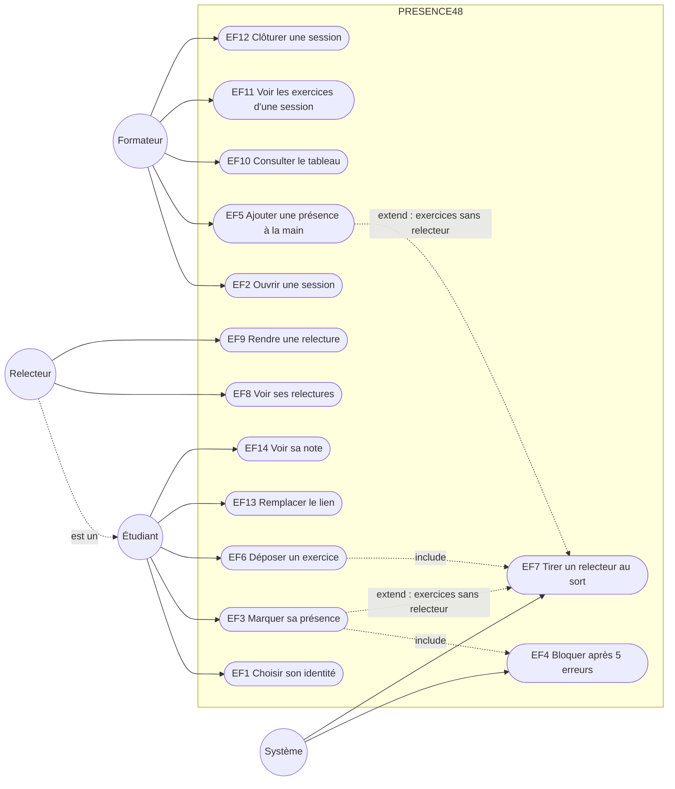

# D1 — Cas d'utilisation

Source : [CAHIER_DES_CHARGES.md](../CAHIER_DES_CHARGES.md) §2 et §4. Le **Relecteur** est un Étudiant assigné par le système : il hérite de l'Étudiant (généralisation), ce n'est pas une table distincte.

