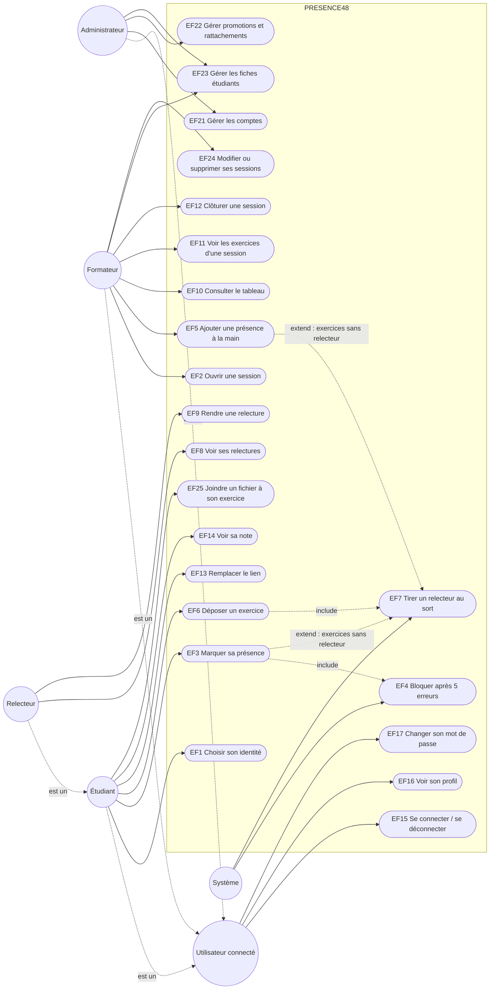

# D1 — Cas d'utilisation

Source : [CAHIER_DES_CHARGES.md](../CAHIER_DES_CHARGES.md) §2, §2 bis et §4. **v2** : acteur Administrateur, cas d'accès (EF15–EF19) et d'administration (EF21–EF25). Le **Relecteur** est un Étudiant assigné par le système : il hérite de l'Étudiant (généralisation), ce n'est pas une table distincte.

