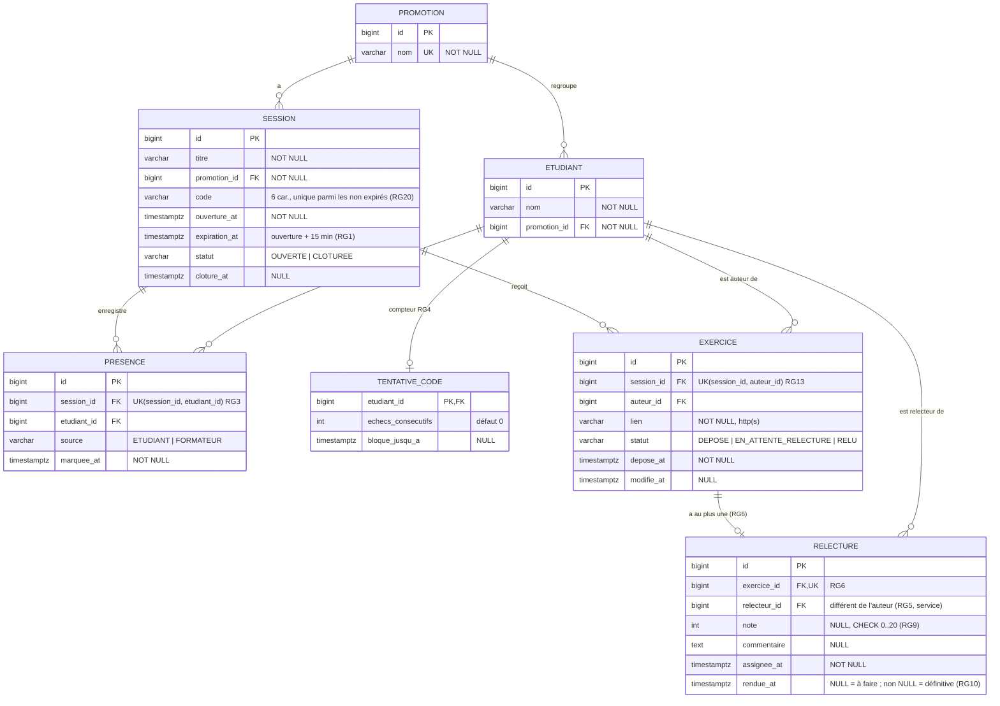

# D2 — Modèle de données

**Doit correspondre exactement à `backend/src/main/resources/db/migration/V1__init.sql`.** Toute migration qui change le schéma met ce diagramme à jour dans la même PR. Dictionnaire complet : [CAHIER_DES_CHARGES.md](../CAHIER_DES_CHARGES.md), annexe B.

Contrainte non exprimable en SQL simple : `relecture.relecteur_id ≠ exercice.auteur_id` et relecteur présent à la session (RG5, RG7). Elle est garantie par `RelectureService` et couverte par un test unitaire.
