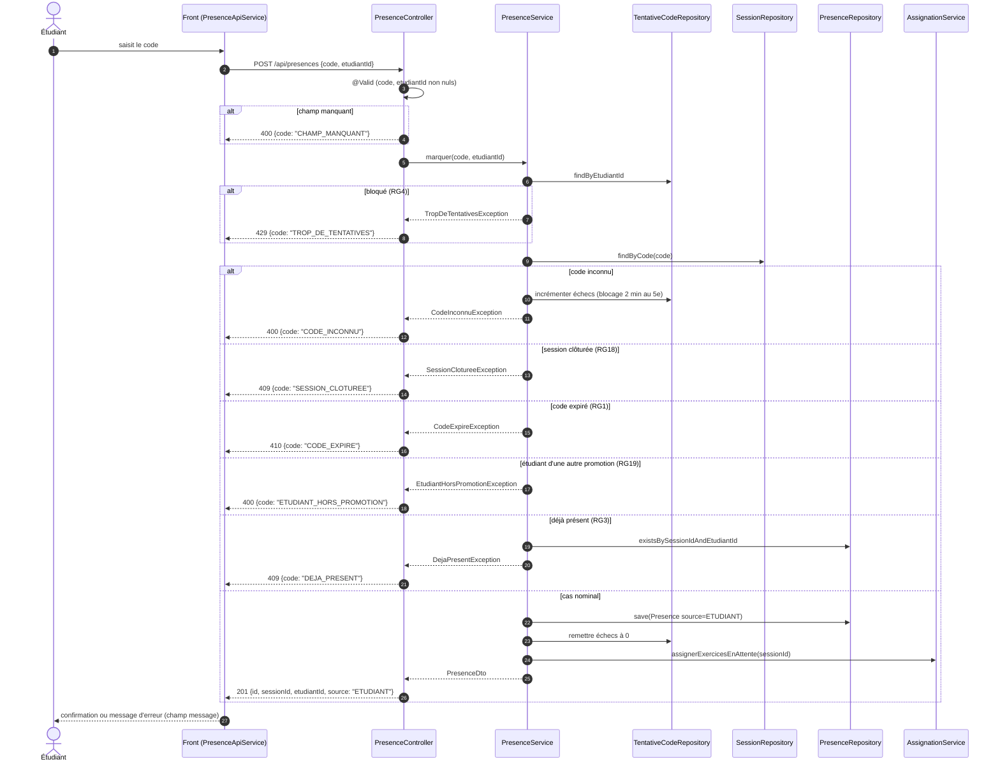

# D3 — Séquence : marquer sa présence

Codes HTTP identiques à `POST /api/presences` dans [api/contrat.yaml](../../api/contrat.yaml). L'ordre des contrôles est celui de la fiche SF-3.

Les exceptions métier sont traduites en `{code, message}` par un unique `@RestControllerAdvice` (B4). Le contrôleur ne fait aucun accès à la base (B3).
