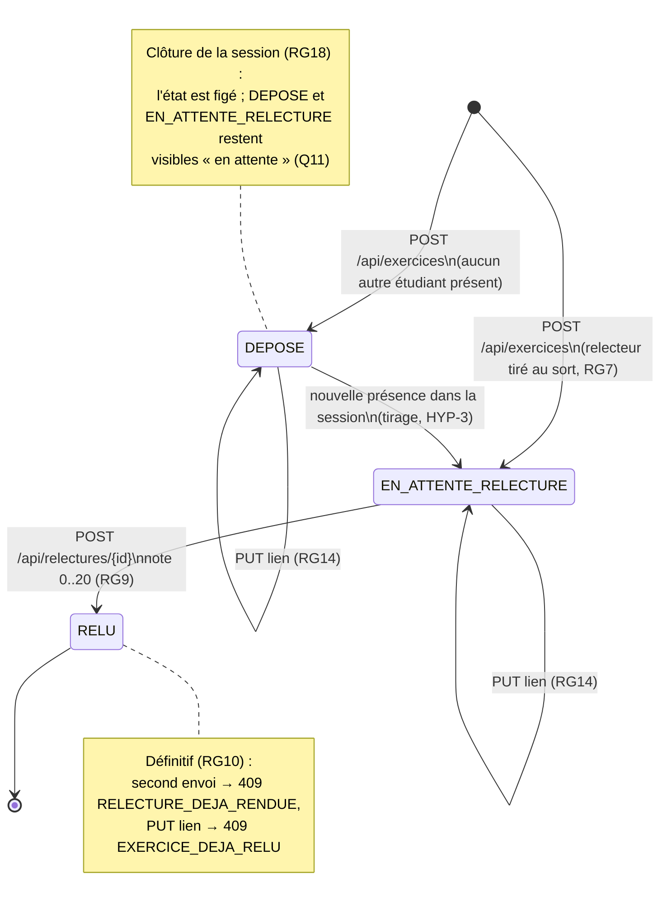

# D4 — États-transitions du cycle de vie d'un exercice (bonus)

```mermaid
stateDiagram-v2
    [*] --> DEPOSE : POST /api/exercices\n(aucun autre étudiant présent)
    [*] --> EN_ATTENTE_RELECTURE : POST /api/exercices\n(relecteur tiré au sort, RG7)
    DEPOSE --> EN_ATTENTE_RELECTURE : nouvelle présence dans la session\n(tirage, HYP-3)
    DEPOSE --> DEPOSE : PUT lien (RG14)
    EN_ATTENTE_RELECTURE --> EN_ATTENTE_RELECTURE : PUT lien (RG14)
    EN_ATTENTE_RELECTURE --> RELU : POST /api/relectures/{id}\nnote 0..20 (RG9)
    RELU --> [*]

    note right of RELU
        Définitif (RG10) :
        second envoi → 409 RELECTURE_DEJA_RENDUE,
        PUT lien → 409 EXERCICE_DEJA_RELU
    end note
    note left of DEPOSE
        Clôture de la session (RG18) :
        l'état est figé ; DEPOSE et
        EN_ATTENTE_RELECTURE restent
        visibles « en attente » (Q11)
    end note
```

Côté API, « en attente » (Q11) recouvre `DEPOSE` et `EN_ATTENTE_RELECTURE`.
