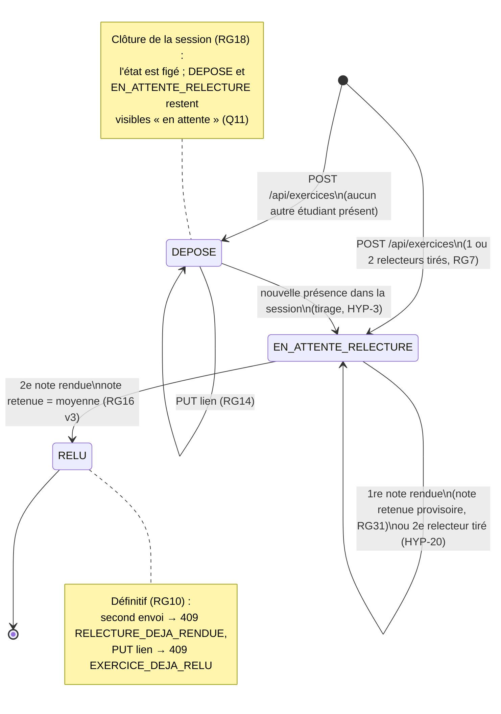

# D4 — États-transitions du cycle de vie d'un exercice (bonus)

**v3 (enveloppe, #85)** : l'exercice ne passe à `RELU` que lorsque ses **deux** relecteurs ont rendu ; entre les deux, la note retenue est provisoire (RG31).

Côté API, « en attente » (Q11) recouvre `DEPOSE` et `EN_ATTENTE_RELECTURE`.
