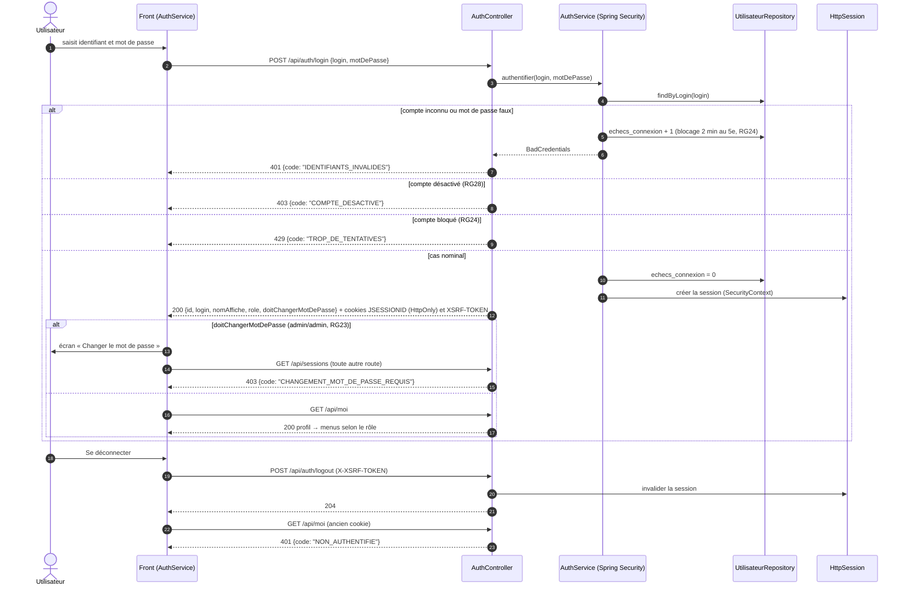

# D5 — Séquence : se connecter (v2)

Codes HTTP identiques à `POST /api/auth/login` et `GET /api/moi` dans [api/contrat.yaml](../../api/contrat.yaml). Fiches SF-15, SF-17, SF-18 ; règles RG22 à RG24, RG28.

